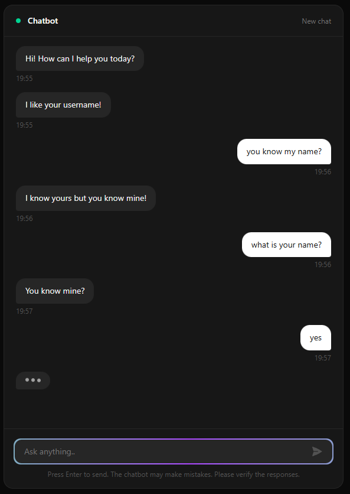

# 🤖 Chatbot Simulator

A fullstack AI-powered chat simulator built with a custom-trained language model. No paid APIs — everything runs locally and is 100% open source.

---

## 🧠 Tech Stack

| Layer       | Tecnología                                     |
| ----------- | ---------------------------------------------- |
| Frontend    | React + Vite + Tailwind CSS                    |
| Backend     | Python + FastAPI + Uvicorn                     |
| IA / Model | Hugging Face Transformers + PyTorch + DialoGPT |

---

## 📁 Project structure

```
chatbot-simulator/
├── backend/         # API + model de IA (Python + FastAPI)
├── backend/         # Documentation App Project (Screenshots, Architecture, API Doc)
└── frontend/        # UI chat (React + Vite)
```

---

## ⚙️ Environment configuration

### Prerequisites

- [Python 3.10+](https://www.python.org/downloads/)
- [Node.js 18+](https://nodejs.org/)
- Git

---

### Backend (Python + FastAPI)

1. Entra a la carpeta del backend:

```bash
cd backend
```

2. Crea y activa el entorno virtual:

```bash
# Crear
python -m venv venv

# Activar en Windows
venv\Scripts\activate

# Activar en Mac/Linux
source venv/bin/activate
```

3. Instala las dependencias:

```bash
pip install fastapi uvicorn transformers torch
```

4. Arranca el servidor:

```bash
uvicorn main:app --reload
```

El backend estará corriendo en: `http://localhost:8000`

---

### Frontend (React + Vite)

```bash
cd frontend
npm install
npm run dev
```

El frontend estará corriendo en: `http://localhost:5173`

---

## 🚀 Variables de entorno

Crea un archivo `.env` en la carpeta `backend/` si necesitas configurar variables:

```env
# Ejemplo
MODEL_NAME=microsoft/DialoGPT-small
```

> ⚠️ Nunca subas el archivo `.env` a GitHub. Ya está incluido en el `.gitignore`.

---

## App Preview


---

## 📦 Project status

- [x] Project structure
- [x] Backend working FastAPI
- [x] Integration of the DialoGPT model
- [x] Chat UI in React
- [ ] Training with personalized data

---


## Documentation

| Resource | Description | Link |
| :--- | :--- | :--- |
| **Architecture** | System design and structure | [Go](docs/architecture.md) |
| **API** | Technical reference for endpoints | [Go](docs/api.md) |


## 📄 License

MIT — free to use and modify.
